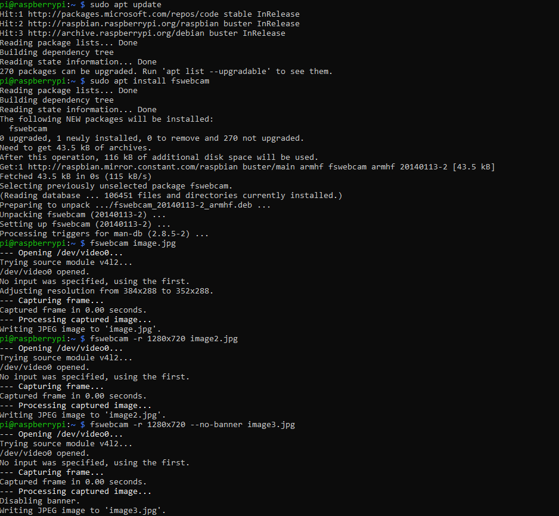
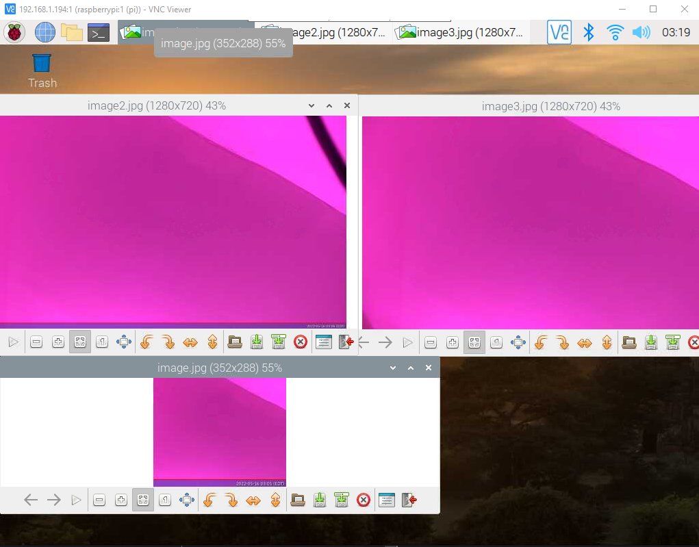

## Lab 2

For this lab we did Serial communication, breadboard, USB webcam, USB microphone and 3.5-mm headphone tests with the raspberry pi. I documented the use of the webcam.

This image shows me installing fswebcam, then using my webcam to capture 3 images.

This image shows the 3 images captured, using the VNC server to view the display of the raspberry pi.

