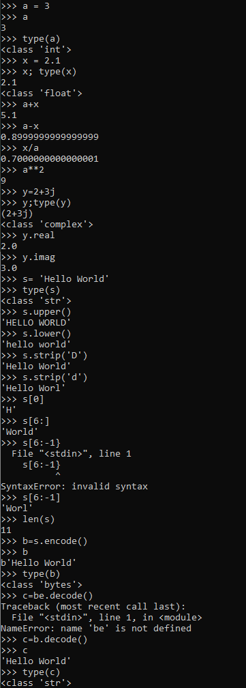
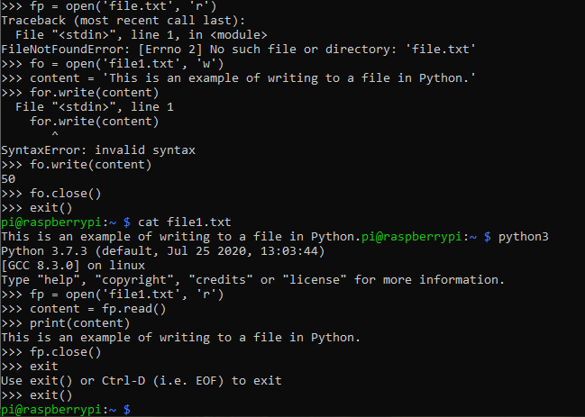
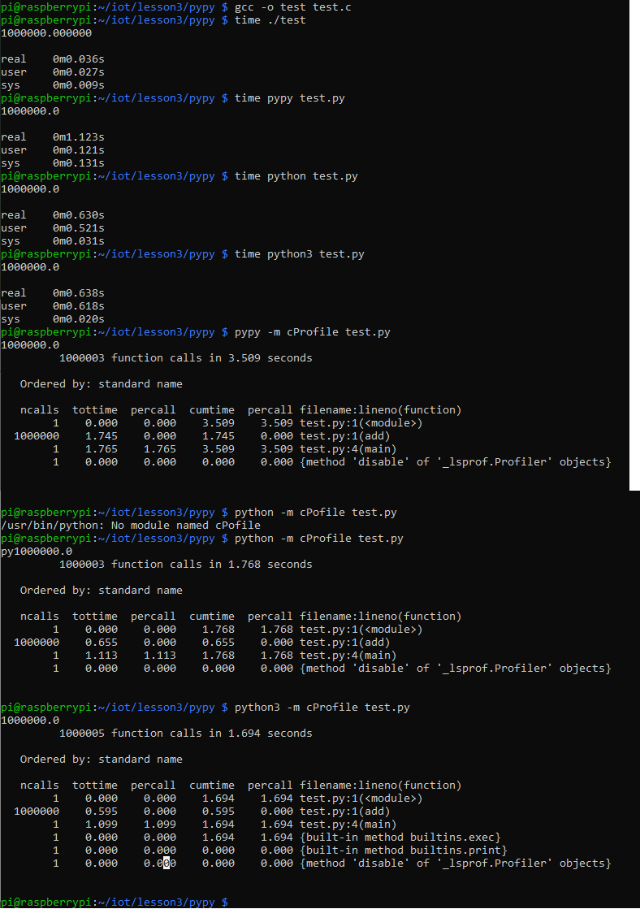

## Lab 3

For lab 3 we used python3 to do python on the raspberry pi. I documented myself using numbers and strings in python, and also reading to writing to a file in python.

We also tested code using a breadboard, remote GPIO, PyPy, and Doxygen. I documented myself using PyPy.

Numbers and Strings being used in python on the Raspberry Pi.

Reading and Writing to a file being used in python on the Raspberry Pi.

Testing code in PyPy, python, and python3 then viewing the time taken for each.

