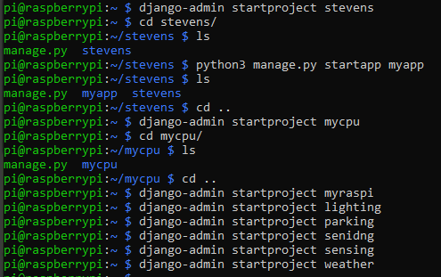

## Lab4

For this lab we were to install Django and Django REST frameworks on the Raspberry Pi, then install MariaDB server and client. We were then supposed to start some projects, run Flask server and run a LAMP web server with wordpress.

I was unable to get either server working.

The projects being started

