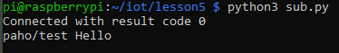

## Lab 5

For lab 5 we started by downloading and installing mosquitto both on our main machine and the Raspberry Pi. We then installed Paho and ran code using that.

Initial sub.py and pub.py runs.

Running subcpu.py and pubcpu.py.

Demoing subraspi.py and pubraspi.py.

